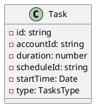
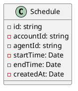

# Schedule and Tasks Management API

## Technologies

This application uses the following technologies:

- NestJs
- PostgreSQL as the database
- Docker for containerization
- TypeScript
- Clean Architecture
- Test-Driven Development (TDD)
- Domain-Driven Design (DDD)
- SOLID principles
- Design Patterns

## Running the Application

To run the application, first, run the `docker-compose.yaml` file. After that, you can start the application using the following commands:

```bash
# development
$ npm run start

# watch mode
$ npm run start:dev

# production mode
$ npm run start:prod
```

## Running Tests

To run the tests, use the following commands:

```bash
# unit tests
$ npm run test

# e2e tests
$ npm run test:e2e

# test coverage
$ npm run test:cov
```

## UML Diagrams

### Tasks Entity



### Schedules Entity



## Next Steps

- Implement authentication
- Implement caching for performance improvement
- Implement validation for overlapping schedules
- Implement GraphQL for more detailed queries
- Implement one lambda function to notify the user about the schedule near

## About the API

The purpose of this API is to create an application for managing schedules and tasks, whether for daily activities or work and personal projects. It is designed to be scalable and to evolve in a collaborative environment, developed with a rich domain and applying DDD principles and other mentioned practices.

## Environment Files

- `.env` for running the application
- `.env.e2e` for end-to-end tests
- `.env.test` for unit and integration tests
